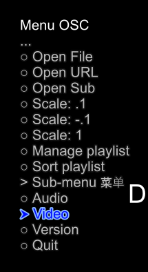
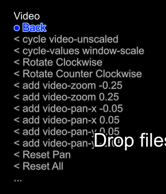
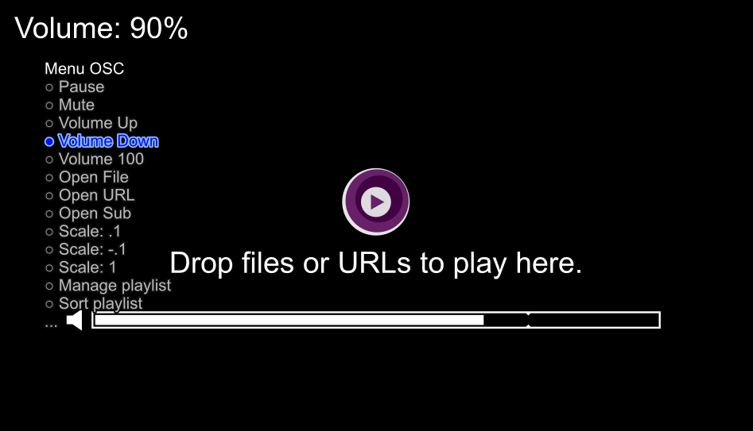

# mpv scripts

This folder contain the mpv plugins that I collected from Internet.
Some are modified by me

## scripts\menu-osc.lua

An on screen menu

## scripts\PSOpenFileDialog.lua

An open file dialog by Powershell and .Net Framework

## scripts\save_last_window_rect.lua

Save the windows position on exit by Powershell with user32.dll

## scripts\SmartCopyPaste.lua

Copy and paste function by Powershell

## scripts\playlistmanager.lua

An on screen playlist manager

## scripts\on_top_only_while_playing.lua

Keep window on top while playing

## scripts\pause-when-minimize.lua

Pause playing when minimize

## scripts\persist-properties.lua

Save the properties on exit

---

## Screenshot for menu-osc

